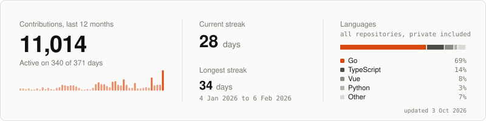

### Yusuf Akinleye

Backend software and platform engineer. I build reliable systems. Founder of [FoldLabs](https://foldlabs.pro). Currently learning Zig.

<picture>
  <source media="(prefers-color-scheme: dark)" srcset="stats/card-dark.svg">
  
</picture>

**Selected work**

- [Rixl](https://docs.rixl.com): the largest contributor to its backend; owned billing, passkey sign-in, authorization policies and canary releases.
- [Eazyfit](https://www.eazyfitfashion.com): built most of the backend for this live marketplace, including escrow payouts.
- [babit](https://github.com/TheBraveByte/babit): proof of what an AI agent did, and who allowed it.
- [bloom-parser](https://github.com/TheBraveByte/bloom-parser): images, PDFs and spreadsheets in, one structured document out.

**Developer stories**

- ["Unsure" is not "failed"](stories/unsure-is-not-failed.md)
- [Explicit work, not polling](stories/explicit-work-not-polling.md)

[Website](https://thebravebyte.pages.dev) · [LinkedIn](https://www.linkedin.com/in/yusuf-akinleye-bb35981b4/) · [Email](mailto:ayaaakinleye@gmail.com)
